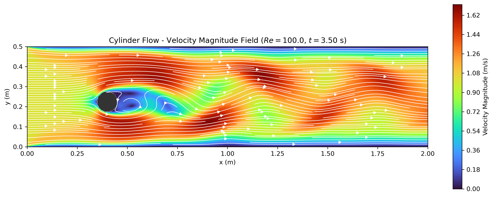

<div align="center">

| **Author** | **Project** | **Documentation** | **Build Status** | **Code Quality** | **License** |
|:----------:|:-----------:|:-----------------:|:----------------:|:----------------:|:-----------:|
| **Filippo Di Ludovico** | **NAVTILVS** | [](https://navier-stokes-solver.readthedocs.io/en/latest/?badge=latest) | [](https://github.com/fildl/NAVTILVS/actions/workflows/python.yml) | [](https://app.codacy.com/gh/fildl/NAVTILVS/dashboard?utm_source=gh&utm_medium=referral&utm_content=&utm_campaign=Badge_grade) | [](https://opensource.org/licenses/MIT) |

<br/>


[](https://github.com/fildl/NAVTILVS/issues)
[](https://github.com/fildl/NAVTILVS/stargazers)

</div>

# NAVTILVS

**NAVTILVS** (**NAV**ier-Stokes **T**wo-dimensional **I**ncompressib**L**e **V**isual **S**olver) is a Python library designed to simulate and visualize 2D incompressible fluid flows using finite difference numerical methods on Cartesian grids.

> **Documentation**: For mathematical derivations, numerical schemes and simulation galleries visit the documentation on [Read the Docs](https://navier-stokes-solver.readthedocs.io/en/latest/).

<div align="center">
  
  <p><i>Flow past a circular cylinder (Re = 100): Kármán vortex street resolved with the upwind finite difference scheme.</i></p>
</div>

---

## Table of Contents

* [Features](#features)
* [Installation](#installation)
* [Quickstart](#quickstart)
* [Testing](#testing)
* [Documentation](#documentation)
* [Contributions](#contributions)
* [Authors](#authors)
* [Citation](#citation)
* [License](#license)

---

## Features

- **2D Incompressible Navier–Stokes Solver**: Solves the 2D unsteady incompressible Navier–Stokes equations under the Boussinesq/constant-density approximation.
- **First-Order Upwind Differencing**: Automatically selects backward or forward spatial derivatives based on local velocity direction, eliminating unphysical downwind oscillations and preserving numerical stability.
- **Vectorized Pressure Poisson Solver**: Pressure is computed via an iterative Poisson solver optimized for NumPy vectorization.
- **Adaptive Dynamic Time Stepping**: Dynamically adjusts $\Delta t$ at each iteration satisfying both convective CFL and 2D viscous diffusion stability limits.
- **Visual Analytics**: Dedicated visualization tools generating directional quiver velocity fields, streamlines, pressure contours and vorticity fields.

---

## Installation

NAVTILVS requires **Python >= 3.10**.

1. Clone repository
```bash
git clone https://github.com/fildl/NAVTILVS.git
cd NAVTILVS
```

Or clone via SSH:
```bash
git clone git@github.com:fildl/NAVTILVS.git
cd NAVTILVS
```

2. Create and activate a virtual environment (recommended)
```bash
conda create -n navtilvs python=3.12
conda activate navtilvs
```

3. Install dependencies and the package
```bash
python -m pip install -r requirements.txt
```

4. Then choose the installation mode:
* Standard Installation (User Mode):
```bash
python -m pip install .
```

* Development Installation (Editable Mode):
```bash
python -m pip install -e ".[dev]"
```

## Documentation

The full documentation can be found at [NAVTILVS Documentation](https://navier-stokes-solver.readthedocs.io/en/latest/)

## References

This project's core solver is based on the educational program [CFDPython: the 12 steps to Navier-Stokes](https://github.com/barbagroup/CFDPython) by Prof. Lorena A. Barba's group. 

* Barba, Lorena A., and Forsyth, Gilbert F. (2018). CFD Python: the 12 steps to Navier-Stokes equations. *Journal of Open Source Education*, 1(9), 21, [https://doi.org/10.21105/jose.00021](https://doi.org/10.21105/jose.00021).
